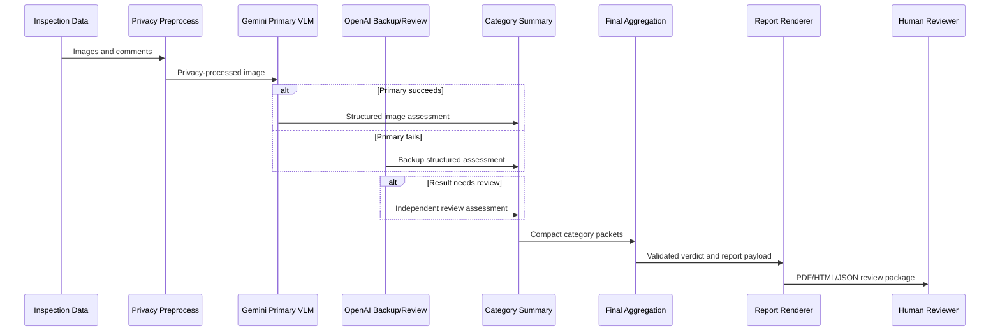

# School Condition Validator

This repo is an early version of a school inspection validation app. It takes inspection photos and officer comments, checks what is visible in the images, compares that with the comments, and produces structured category summaries and a final review report.

The project is being converted from a notebook prototype into a FastAPI backend and frontend app.

This is not a safety certification system. It does not certify compliance, structural soundness, electrical safety, or serviceability. It is meant to help organize visual inspection evidence and create a review package that a qualified person can check.

## About the Project

Many field inspections end up as scattered images, short comments, missing notes, and manual summary reports. This project tries to make that workflow more consistent.

The current prototype:

- reads school inspection images grouped by category,
- reads image-level and category-level officer comments,
- creates privacy-processed image copies before model calls,
- asks vision models to assess only visible evidence,
- compares officer comments with the visible evidence,
- saves full image-level audit JSON,
- creates compact category summaries,
- computes deterministic rollups in code,
- asks a final LLM to organize the overall verdict,
- asks a separate LLM to draft report content,
- renders Markdown, HTML, JSON, and PDF report artifacts.

The key design choice is that LLMs are used for interpretation and writing, while code handles counting, validation, routing, status floors, and report rendering.

## Current Status

This repo is in the modularization phase.

The main workflow exists in `reviewed-updated-simplified-SSV.ipynb`, which is kept as a reference notebook and ignored by git. The backend package structure has been created, and the next step is to extract the notebook into small modules with tests.

The first backend modules will focus on schemas and deterministic helper logic before adding model clients, LangGraph orchestration, aggregation, report rendering, and FastAPI routes.

## Models

The notebook currently uses:

```text
PRIMARY_VLM_MODEL = "gemini-3.1-flash-lite"
BACKUP_VLM_MODEL = "gpt-4.1-mini"
ESCALATION_REVIEW_MODEL = "gpt-4.1-mini"
FINAL_AGGREGATION_MODEL = "gpt-4.1-mini"
FINAL_REPORT_MODEL = "gpt-4.1-mini"
```

Gemini is used first for image-level visual assessment. OpenAI `gpt-4.1-mini` is used as a backup if the primary model fails, and as an independent review model when a result is high-risk, unclear, contradictory, or otherwise needs a second pass.

The final aggregation step also uses `gpt-4.1-mini`, but it only receives compact category-level data and deterministic rollups. It is not trusted to count issues from scratch or weaken the computed status floor.

The report-content step is separate. It writes report-ready text, but code validates that it does not change the already validated status, categories, counts, priorities, or disclaimer.

## Inspection Flow

There are four main layers:

1. **Image assessment**
   - privacy-process the source image,
   - run the primary VLM,
   - fall back to the backup model if needed,
   - run independent review when uncertainty or severity warrants it,
   - save a full image audit JSON.

2. **Category consolidation**
   - combine image-level results into one compact category JSON,
   - keep issue counts, key findings, documentation gaps, actions, and human-review status,
   - avoid sending full image audits into the final LLM.

3. **Final aggregation**
   - build compact category packets,
   - compute deterministic rollups,
   - call the final LLM for a school-level verdict,
   - validate that the LLM did not invent, omit, duplicate, or weaken anything important.

4. **Report generation**
   - call a separate report-content LLM,
   - validate the report content,
   - render Markdown, HTML, JSON, and PDF in code,
   - check that the saved artifacts contain required content.

## Schematic



## Why LangGraph

The image workflow uses LangGraph because each image can take a different route. One image might only need the primary model. Another might need backup. Another might need independent review and human-review flags.

The current graph is:

```text
privacy_preprocess
  -> run_primary_model
  -> optional run_backup_model
  -> optional run_review_model
  -> finalize_image
```

This keeps routing explicit and configurable. Long term, the same pattern can support other field inspection workflows with different nodes, prompts, models, retry rules, and review criteria.

## Current Categories

The school prototype supports:

- `ceiling`
- `classroom`
- `corridor`
- `electrical`
- `exterior`
- `fire_extinguisher`
- `staircase`
- `washroom`
- `other`

Each category has its own inspection focus. For example, electrical images are checked for visible issues like open wiring, uncovered parts, blocked access, rust, broken covers, burn marks, and physical damage. Washroom images are checked for visible issues like dirt, staining, waste, damaged fixtures, wet floors, standing water, dampness, and leakage.

## Input Format

The notebook prototype expects a local folder like this:

```text
school/
  category_name/
    images/
      image_1.jpg
      image_2.jpg
    comments/
      image_1.txt
      image_2.txt
      overall_comments.txt
```

At the moment, the notebook discovers `.jpg` files. Support for uploads, `.jpeg`, `.png`, and uppercase extensions should be added in the backend.

## Outputs

Generated files are written outside the source dataset:

```text
school_validation_outputs/
  privacy_images/
    category_name/
      image_name.jpg
  model_outputs/
    category_name/
      image_name.json
  category_outputs/
    category_name_image_assessments.json
  final_reports/
    final_aggregation_raw_output.json
    final_aggregation_output.json
    school_safety_final_report_content.json
    report_generation_payload.json
    school_safety_final_report.md
    school_safety_final_report.html
    school_safety_final_report.pdf
```

The separation is intentional:

- image JSON files keep the detailed audit trail,
- category JSON files stay compact and report-friendly,
- final reports are generated from validated category-level data.

## Guardrails

The project uses several guardrails to keep the output cautious:

- Raw images are privacy-processed before model calls.
- Officer comments are treated as context, not ground truth.
- Visible image evidence drives findings and risk.
- Hidden conditions are not inferred.
- Human review is required when evidence is unclear, insufficient, contradictory, failed, or needs qualified interpretation.
- The final LLM cannot invent categories or omit processed categories.
- The final LLM cannot weaken the deterministic status floor.
- Report content cannot change the validated verdict.
- Report rendering and artifact validation are done in code.

The required report disclaimer is:

```text
This AI-assisted visual inspection summary does not certify safety, compliance, structural soundness, electrical safety, or serviceability. It must be reviewed by qualified personnel before decisions are made.
```

## Setup

This section will become more complete once the backend is fully extracted.

For now, the backend uses `uv` and the dependencies listed in `backend/pyproject.toml`.

Required environment variables:

```text
GEMINI_API_KEY
OPENAI_API_KEY
```

Optional:

```text
LANGSMITH_PROJECT
```

API keys should be provided through environment variables or a local `.env` file. Do not commit secrets.

## Repository Layout

```text
backend/
  school_safety_validator/
    config.py
    schemas.py
    paths.py
    privacy.py
    prompts.py
    model_clients.py
    model_parsing.py
    assessment_rules.py
    graph.py
    category_runner.py
    aggregation.py
    report_content.py
    report_rendering.py
    report_validation.py
    storage.py
    api/
      main.py
      routes.py
      models.py
  sample_data/
  utility_files/
  tests/
  utils/

frontend/
docs/
```

`backend/utils/` contains existing logging and exception helpers. Their logic is intentionally kept unchanged while the notebook code is modularized.

## Planned API

The FastAPI service is expected to support:

- creating an inspection run,
- uploading or registering images and comments,
- starting a run,
- checking run status,
- reading image audit results,
- reading category summaries,
- reading the human-review queue,
- triggering final aggregation,
- triggering report generation,
- downloading report artifacts.

The API should not expose provider API keys, raw secrets, unsupported certification claims, or internal stack traces.

## Beyond School Inspections

The long-term goal is a configurable field-inspection validation platform. School inspections are the first focused use case.

Other possible workflows include:

- industrial facility inspections,
- office facility inspections,
- warehouse inspections,
- hospital or clinic facility reviews,
- construction-site walkthroughs,
- retail branch maintenance checks,
- fire-safety equipment documentation reviews,
- property handover inspections.

The reason to keep the workflow graph-based is that these domains may need different prompts, model routing, evidence rules, escalation paths, and report formats.

## Next Steps

- Extract schemas from the notebook.
- Extract deterministic assessment and aggregation rules.
- Add tests for the deterministic logic.
- Add model-client wrappers that can be mocked in tests.
- Move the LangGraph image workflow into backend modules.
- Add local storage helpers.
- Add report rendering and validation modules.
- Build the FastAPI routes.
- Add the frontend once the API contracts are stable.

Pull requests and issues are welcome once the first modular backend is in place. The current priority is preserving the notebook behavior while making the code testable and deployable.
