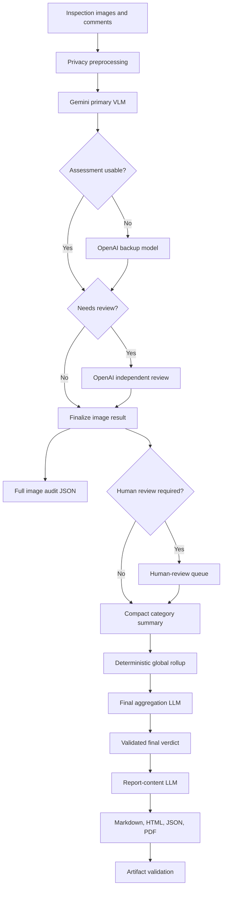

# SchoolReview AI

SchoolReview AI is an early-stage AI systems project for validating school inspection evidence. It compares school inspection images with officer comments, keeps the analysis grounded in visible evidence, and produces structured outputs that can be reviewed by a human.

The project is intentionally cautious. It is not a safety certification system and does not certify compliance, structural soundness, electrical safety, or serviceability. Its purpose is to organize visual evidence, flag inconsistencies, and produce review-ready inspection artifacts.

This repository is built as a portfolio project around practical AI engineering: multimodal model orchestration, deterministic validation, privacy-aware preprocessing, structured outputs, report generation, and a minimal API layer.

## What It Does

The backend currently supports a local-first school inspection workflow:

- reads school inspection images and comments by category,
- creates privacy-processed image copies before model calls,
- uses a LangGraph image workflow for model routing,
- calls Gemini as the primary vision model,
- uses OpenAI as backup and independent review when needed,
- compares officer comments with visible image evidence,
- preserves full image-level audit JSON,
- creates compact category summaries,
- computes deterministic school-level rollups,
- validates final LLM verdicts against deterministic status floors,
- generates report-ready content,
- renders Markdown, HTML, JSON, and PDF report artifacts,
- exposes a minimal FastAPI layer for staged inspection runs,
- includes tests for the deterministic and API-facing parts of the backend.

The core design principle is:

```text
LLMs interpret visible evidence. Deterministic code validates, counts, routes, and renders.
```

## Why This Project

Field inspection data is often inconsistent: photos may be scattered, comments may be incomplete, and final summaries can take manual effort. This project explores how AI can help structure that workflow without pretending to replace qualified inspection review.

The engineering focus is on:

- reliable AI workflow orchestration,
- multi-provider fallback behavior,
- schema-driven model outputs,
- deterministic safety guardrails,
- human-review routing,
- report artifact validation,
- API boundary design for uploaded inspection evidence.

## Current Status

This is a working prototype, not a production inspection product.

Implemented:

- modular Python backend,
- Pydantic schemas for inputs and outputs,
- OpenCV-based privacy preprocessing,
- LangGraph image assessment workflow,
- Gemini primary vision assessment,
- OpenAI backup and review assessment,
- compact category-level summaries,
- final aggregation with deterministic status-floor validation,
- report-content generation,
- deterministic Markdown, HTML, JSON, and PDF rendering,
- ReportLab fallback when WeasyPrint is unavailable,
- rendered report validation,
- minimal FastAPI app for creating runs, uploading images, starting processing, checking status, recording human-review decisions, and downloading artifacts,
- pytest tests for key deterministic logic and API routes.

Still early-stage:

- API run state is in memory, so it is suitable for local testing, not production persistence.
- Live model runs require provider API keys.
- The sample dataset is synthetic and intended for development.
- The project does not make final safety, compliance, or serviceability decisions.

## Safety And Scope Disclaimer

This project must not be used as a safety certification tool.

Required report disclaimer:

```text
This AI-assisted visual inspection summary does not certify safety, compliance, structural soundness, electrical safety, or serviceability. It must be reviewed by qualified personnel before decisions are made.
```

The system only uses visible image evidence for visual findings. It does not infer hidden causes, live electrical status, structural soundness, smells, water quality, or off-image conditions.

## Architecture Overview



## Repository Layout

```text
.
  README.md
  AGENTS.md
  docs/
    progress_notes/
  backend/
    pyproject.toml
    uv.lock
    README.md
    .env.example
    backend-final-code-review.md
    reference_notebook/
    school_safety_validator/
      api/
        fastapi_application.py
        inspection_api_routes.py
        inspection_api_models.py
      inspection_data_models.py
      inspection_runtime_settings.py
      inspection_file_paths.py
      image_privacy_preprocessing.py
      inspection_prompt_templates.py
      vision_model_provider_clients.py
      structured_model_response_parsing.py
      deterministic_assessment_rules.py
      image_assessment_workflow_graph.py
      single_category_inspection_runner.py
      all_categories_inspection_runner.py
      inspection_output_storage.py
      final_verdict_aggregation.py
      final_report_content_generation.py
      final_report_artifact_rendering.py
      final_report_artifact_validation.py
      pipeline.py
      logging_config.py
    scripts/
      run_pipeline_from_json.py
    tests/
    sample_data/
    utility_files/
    utils/
  frontend/
```

## Inspection Categories

The current school prototype supports:

- `ceiling`
- `classroom`
- `corridor`
- `electrical`
- `exterior`
- `fire_extinguisher`
- `staircase`
- `washroom`
- `other`

Each category has a focused prompt. For example, electrical images focus on visible wiring, panels, exposed parts, blocked access, rust, broken covers, burn marks, and physical damage. Washroom images focus on visible cleanliness issues, staining, waste, damaged fixtures, wet floors, dampness, standing water, and leakage.

## Models

Default model settings are defined in `backend/school_safety_validator/inspection_runtime_settings.py`.

```text
PRIMARY_VLM_MODEL = "gemini-3.1-flash-lite"
BACKUP_VLM_MODEL = "gpt-4.1-mini"
ESCALATION_REVIEW_MODEL = "gpt-4.1-mini"
FINAL_AGGREGATION_MODEL = "gpt-4.1-mini"
FINAL_REPORT_MODEL = "gpt-4.1-mini"
```

The model choices are cost-conscious and are paired with deterministic validation. The workflow treats model output as structured evidence interpretation, not as final authority.

## Setup

This backend uses `uv`.

From the repository root:

```bash
cd backend
uv sync
```

Required for live model calls:

```text
GEMINI_API_KEY
OPENAI_API_KEY
```

Optional:

```text
LANGSMITH_PROJECT
LANGSMITH_TRACING
```

You can set these in your shell or a local `backend/.env` file. Do not commit real secrets.

## Run Tests

From `backend/`:

```bash
uv run pytest
```

Normal tests should use mocked clients and should not require live model calls.

## Run The FastAPI App

From `backend/`:

```bash
uv run uvicorn school_safety_validator.api.fastapi_application:app --reload
```

The minimal API currently supports:

- `GET /health`
- `POST /inspection-runs`
- `POST /inspection-runs/{run_id}/sections/{section_name}/images`
- `POST /inspection-runs/{run_id}/start`
- `GET /inspection-runs/{run_id}`
- `GET /inspection-runs/{run_id}/human-review`
- `POST /inspection-runs/{run_id}/human-review/{review_id}`
- `GET /inspection-runs/{run_id}/artifacts/{artifact_name}`

The API stages uploaded images into controlled run folders and returns sanitized status responses instead of exposing local filesystem paths directly.

## Run From JSON

From `backend/`:

```bash
uv run python scripts/run_pipeline_from_json.py \
  --input sample_data/sample_pipeline_request.json \
  --output school_validation_outputs/pipeline_result.json \
  --output-root school_validation_outputs \
  --no-tracing
```

Use `--skip-report` if you only want to run the image/category stages.

## Local Input Format

The lower-level local runners expect category folders like this:

```text
backend/sample_data/school/
  category_name/
    images/
      image_1.jpg
      image_2.jpg
    comments/
      image_1.txt
      image_2.txt
      overall_comments.txt
```

Supported image extensions:

```text
.jpg
.jpeg
.png
```

## Generated Outputs

Generated outputs are written outside the source dataset. API runs use run-scoped output folders under:

```text
backend/school_validation_outputs/api_runs/
```

Typical artifacts include:

- privacy-processed images,
- full image-level audit JSON,
- compact category summaries,
- all-category run summary,
- final aggregation payload and outputs,
- report-generation payload,
- Markdown report,
- HTML report,
- PDF report.

Generated outputs are intentionally ignored by Git.

## Sample Data

The local sample dataset is synthetic and was created for development/testing of this project. It is not an official school inspection dataset.

Related dataset-generation workflow:

[adityaviolin824/synthetic-vlm-dataset-workflow-codex](https://github.com/adityaviolin824/synthetic-vlm-dataset-workflow-codex)

Using synthetic data makes the project easier to share publicly while still exercising realistic workflow cases: multiple categories, image-level comments, category comments, missing notes, review cases, and report generation.

## Guardrails

The project uses several practical guardrails:

- source images are privacy-processed before model calls,
- officer comments are treated as untrusted context,
- visual findings are grounded in visible image evidence,
- unsupported certification language is explicitly avoided,
- low-confidence, unclear, contradictory, failed, or qualified-review cases are routed for human review,
- deterministic code owns counting, status floors, schema validation, and artifact validation,
- report content is validated before rendering,
- generated PDF text is checked for required status/category/disclaimer content.

## Current Limitations

- This is an early-stage prototype.
- The API run store is in memory.
- The privacy preprocessing reduces risk but does not guarantee anonymization.
- Live model behavior depends on provider availability and credentials.
- Report generation may use ReportLab fallback if WeasyPrint is unavailable.
- The output is review support material, not an inspection certification.

## Why This Matters For AI Systems Work

This project is less about a single model call and more about building the surrounding system responsibly:

- controlled inputs,
- privacy preprocessing,
- model fallback paths,
- structured response parsing,
- deterministic validation,
- failure-safe orchestration,
- human-review queues,
- report rendering,
- API-safe response shaping,
- testable components.

Those are the parts that make AI features useful in real software systems.

## Roadmap

Near-term improvements:

- replace in-memory API run state with durable storage,
- add stronger run status tracking,
- improve artifact metadata and download handling,
- add more API tests around failure cases,
- simplify or remove unused utility modules,
- continue tightening report validation,
- add a frontend after API contracts stabilize.
