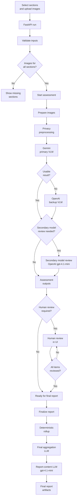
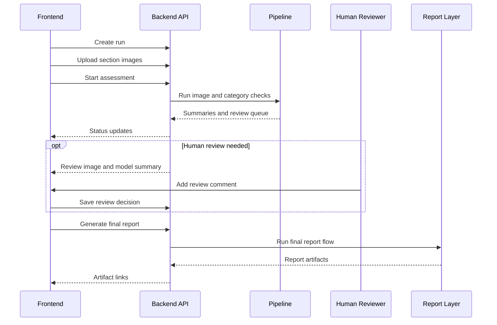

# SchoolReview AI

SchoolReview AI is a local-first prototype for reviewing school inspection evidence. It compares inspection images with officer comments, keeps findings grounded in visible evidence, and produces structured outputs for human review before a final report is generated.

The output is limited to visible evidence. It does not certify safety, compliance, structural soundness, electrical safety, or serviceability. The goal is to organize evidence, surface mismatches, preserve an audit trail, and make review easier.

The implementation currently combines:

- privacy-aware image preprocessing before model calls,
- an image-level LangGraph workflow with primary, backup, and secondary model-review paths,
- structured model outputs validated by deterministic code,
- category-level summaries instead of sending large raw audits into final prompts,
- human-review gating before final report generation,
- deterministic report rendering and artifact validation,
- a small FastAPI and React interface for local testing.

## Current Status

This is a working MVP for local testing and technical review, not a production inspection system.

Implemented:

- Python backend package under `backend/school_safety_validator/`
- local sample dataset under `backend/sample_data/`
- image privacy preprocessing
- Gemini primary vision assessment
- OpenAI backup and secondary model-review paths
- compact category summaries
- deterministic school-level rollups
- final aggregation and report-content LLM calls
- Markdown, HTML, JSON, and PDF report artifacts
- ReportLab PDF rendering by default, with optional WeasyPrint support
- FastAPI endpoints for creating runs, uploading images, starting assessment, recording human review, finalizing reports, and downloading artifacts
- simple React + Vite frontend under `frontend-final/`
- tests for deterministic logic, report rendering, and API behavior

Known limits:

- API run state is in memory. Restarting the backend loses the active run list.
- Generated files are local filesystem artifacts.
- Live model runs require provider API keys.
- The sample dataset is synthetic and intended for development.
- The frontend is intentionally simple and optimized for local testing.

## System Flow



## API And Frontend Flow



## Repository Layout

```text
.
  README.md
  AGENTS.md
  backend/
    README.md
    pyproject.toml
    uv.lock
    .env.example
    sample_data/
    reference_notebook/
    utility_files/
    school_safety_validator/
      api/
      pipeline.py
      image_assessment_workflow_graph.py
      single_category_inspection_runner.py
      all_categories_inspection_runner.py
      final_verdict_aggregation.py
      final_report_content_generation.py
      final_report_artifact_rendering.py
      final_report_artifact_validation.py
    scripts/
    tests/
  frontend-final/
    package.json
    src/
      App.tsx
      api.ts
      types.ts
      styles.css
  docs/
    progress_notes/
  runs/
    api_runs/
```

`runs/` is generated locally and ignored by git.

## Inspection Categories

The current school prototype supports:

- `ceiling`
- `classroom`
- `corridor`
- `electrical`
- `exterior`
- `fire_extinguisher`
- `staircase`
- `washroom`
- `other`

Each category has a focused prompt. The prompts are designed to stay within visible image evidence and avoid unsupported claims.

## Model Settings

Default model names are defined in `backend/school_safety_validator/inspection_runtime_settings.py`.

```text
PRIMARY_VLM_MODEL = "gemini-3.1-flash-lite"
BACKUP_VLM_MODEL = "gpt-4.1-mini"
ESCALATION_REVIEW_MODEL = "gpt-4.1-mini"
FINAL_AGGREGATION_MODEL = "gpt-4.1-mini"
FINAL_REPORT_MODEL = "gpt-4.1-mini"
```

The model outputs are treated as structured evidence interpretation. Deterministic code owns validation, counts, status floors, routing decisions, and report rendering.

## Setup

Backend:

```bash
cd backend
uv sync
```

Frontend:

```bash
cd frontend-final
npm install
```

Required for live model calls:

```text
GEMINI_API_KEY
OPENAI_API_KEY
```

Optional:

```text
LANGSMITH_API_KEY
LANGSMITH_PROJECT
LANGSMITH_TRACING
```

Use environment variables or a local `backend/.env` file. Do not commit real secrets.

## Run The Backend API

From `backend/`:

```bash
uv run uvicorn school_safety_validator.api.fastapi_application:app --reload --host 127.0.0.1 --port 8000
```

Swagger UI:

```text
http://127.0.0.1:8000/docs
```

API-generated run files are written under:

```text
runs/api_runs/<run_id>/
```

## Run The Frontend

From `frontend-final/`:

```bash
npm run dev
```

Open:

```text
http://127.0.0.1:5173
```

The frontend stores only the last run ID in local storage. It does not store uploaded image files or secrets.

## Run From JSON

From `backend/`:

```bash
uv run python scripts/run_pipeline_from_json.py \
  --input sample_data/sample_pipeline_request.json \
  --output school_validation_outputs/local_sample_result.json \
  --output-root school_validation_outputs/local_runs \
  --run-id local_sample
```

To skip final report generation:

```bash
uv run python scripts/run_pipeline_from_json.py \
  --input sample_data/sample_pipeline_request.json \
  --output school_validation_outputs/local_sample_result.json \
  --output-root school_validation_outputs/local_runs \
  --run-id local_sample \
  --skip-report
```

## Tests

Backend:

```bash
cd backend
uv run pytest -q
```

Frontend:

```bash
cd frontend-final
npm run build
```

## Safety And Scope

The required report disclaimer is:

```text
This AI-assisted visual inspection summary does not certify safety, compliance, structural soundness, electrical safety, or serviceability. It must be reviewed by qualified personnel before decisions are made.
```

The system uses visible image evidence for visual findings. It does not infer hidden causes, live electrical status, structural soundness, smells, water quality, or off-image conditions.
