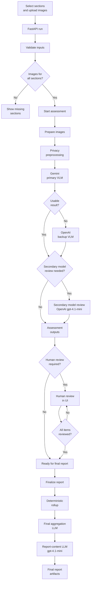
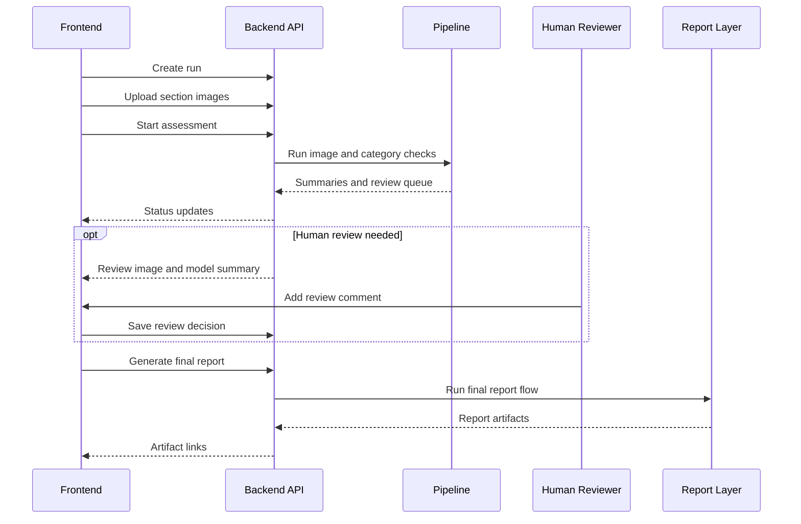

# SchoolReview AI

SchoolReview AI is a local-first prototype for reviewing school inspection evidence. It compares inspection images with officer comments, keeps findings grounded in visible evidence, and produces structured outputs for human review before a final report is generated.

The output is limited to visible evidence. It does not certify safety, compliance, structural soundness, electrical safety, or serviceability. The goal is to organize evidence, surface mismatches, preserve an audit trail, and make review easier.

**Product Tour:** [View the screenshot walkthrough](product-tour/).

The implementation currently combines:

* privacy-aware image preprocessing before model calls,
* an image-level LangGraph workflow with primary, backup, and secondary model-review paths,
* structured model outputs validated by deterministic code,
* category-level summaries instead of sending large raw audits into final prompts,
* human-review gating before final report generation,
* deterministic report rendering and artifact validation,
* a small FastAPI and React interface for local testing.

## Design Priorities

* Images are privacy-processed locally before any model request.
* Model outputs are constrained by schemas and deterministic rules.
* Models do not control counts, status floors, human-review requirements, or certification claims.
* Unclear, contradictory, or failed assessments are routed to human review before a final report is generated.
* Model selection is treated as a configurable cost, latency, and risk trade-off rather than a fixed architectural dependency.

## Current Status

This is a working MVP for local testing and technical review, not a production inspection system.

Implemented:

* Python backend package under `backend/school_safety_validator/`
* local sample dataset under `backend/sample_data/`
* image privacy preprocessing
* Gemini primary vision assessment
* OpenAI backup and secondary model-review paths
* compact category summaries
* deterministic school-level rollups
* final aggregation and report-content LLM calls
* Markdown, HTML, JSON, and PDF report artifacts
* ReportLab PDF rendering by default, with optional WeasyPrint support
* FastAPI endpoints for creating runs, uploading images, starting assessment, recording human review, finalizing reports, and downloading artifacts
* simple React + Vite frontend under `frontend/`
* tests for deterministic logic, report rendering, and API behavior

Known limits:

* API run state is in memory. Restarting the backend loses the active run list.
* Generated files are local filesystem artifacts.
* Live model runs require provider API keys.
* The sample dataset is synthetic and intended for development.
* The frontend is intentionally simple and optimized for local testing.
* The API has no authentication. Do not expose it outside a trusted local environment.
* The current model configuration has been evaluated only for this prototype and should not be assumed to generalize to other inspection domains.

## System Flow



## API And Frontend Flow



## Repository Layout

```text
.
  README.md
  AGENTS.md
  backend/
    README.md
    pyproject.toml
    uv.lock
    .env.example
    sample_data/
    reference_notebook/
    utility_files/
    school_safety_validator/
      api/
      pipeline.py
      image_assessment_workflow_graph.py
      single_category_inspection_runner.py
      all_categories_inspection_runner.py
      final_verdict_aggregation.py
      final_report_content_generation.py
      final_report_artifact_rendering.py
      final_report_artifact_validation.py
    scripts/
    tests/
  frontend/
    package.json
    src/
      App.tsx
      api.ts
      types.ts
      styles.css
  docs/
    progress_notes/
  runs/
    api_runs/
```

`runs/` is generated locally and ignored by git.

## Inspection Categories

The current school prototype supports:

* `ceiling`
* `classroom`
* `corridor`
* `electrical`
* `exterior`
* `fire_extinguisher`
* `staircase`
* `washroom`
* `other`

Each category has a focused prompt. The prompts are designed to stay within visible image evidence and avoid unsupported claims.

## Model Selection

Default model names are defined in `backend/school_safety_validator/inspection_runtime_settings.py`.

```text
PRIMARY_VLM_MODEL = "gemini-3.1-flash-lite"
BACKUP_VLM_MODEL = "gpt-4.1-mini"
ESCALATION_REVIEW_MODEL = "gpt-4.1-mini"
FINAL_AGGREGATION_MODEL = "gpt-4.1-mini"
FINAL_REPORT_MODEL = "gpt-4.1-mini"
```

### Selection Strategy

The pipeline uses tiered model routing instead of sending every request to the most capable and expensive available model.

This keeps the high-volume image-assessment stage fast and cost-aware while reserving the more expensive review path for failed, ambiguous, contradictory, or safety-sensitive cases.

### Primary Image Assessment: Gemini 3.1 Flash-Lite

Gemini 3.1 Flash-Lite is used for the initial image-level assessment because this is the highest-volume stage of the pipeline.

It was selected for its practical balance of:

* multimodal capability,
* structured output quality,
* low latency,
* low API cost.

During testing on this project's synthetic inspection dataset, Gemini 3.1 Flash-Lite produced more consistent and usable structured assessments than the Gemini 2.5 models evaluated earlier.

This is a project-specific observation. It should not be interpreted as a general claim that the model will outperform other Gemini models across unrelated workloads.

### Backup And Secondary Review: GPT-4.1 Mini

GPT-4.1 mini is used when:

* the primary model call fails,
* the primary response cannot be parsed or validated,
* deterministic checks detect ambiguity or contradiction,
* the assessment meets configured escalation conditions,
* a secondary review is required before human review or report generation.

It was selected because it produced more dependable instruction-following and structured review outputs during project testing.

Using it selectively avoids paying the additional cost and latency for every straightforward image while still providing a stronger review path when the initial result is not sufficiently dependable.

### Final Aggregation And Report Generation: GPT-4.1 Mini

GPT-4.1 mini is also used for final aggregation and report-content generation.

A more capable reasoning model could be used for these stages, including models from the GPT-5 family or later model generations. For this prototype, GPT-4.1 mini was retained because it provided an acceptable balance of:

* output quality,
* structured instruction-following,
* response latency,
* API cost.

The final models do not directly control:

* category counts,
* deterministic status floors,
* provisional status,
* human-review requirements,
* certification or compliance claims,
* final artifact rendering.

These responsibilities remain in deterministic application code.

### Configurable Risk, Cost, And Latency Trade-Offs

The configured models are prototype defaults, not permanent architectural requirements.

A deployment can replace individual models without redesigning the wider pipeline. The appropriate configuration depends on:

* inspection risk,
* acceptable latency,
* expected request volume,
* available budget,
* domain-specific evaluation results,
* the quality and availability of human review.

For a higher-risk inspection setting, a more capable reasoning model may be justified for selected stages such as escalation review, final aggregation, or report generation.

Examples could include industrial facilities, power-generation infrastructure, or other environments where missing an important finding may have substantially greater consequences.

A stronger model would usually increase cost and latency. It would not make the system independently safe, authoritative, or suitable for unsupervised decision-making.

Higher-risk deployments would also require:

* representative domain-specific evaluation data,
* conservative escalation thresholds,
* stronger deterministic validation rules,
* qualified human review,
* model and provider version monitoring,
* regression testing whenever a model, prompt, schema, or policy changes.

Model selection should therefore be based on measured performance for the specific inspection domain rather than model size, provider reputation, or benchmark results alone.

## Model Responsibility Boundaries

Model outputs are treated as structured evidence interpretation.

Deterministic application code owns:

* schema validation,
* category and school-level counts,
* status floors,
* human-review routing,
* provisional status,
* artifact generation,
* required disclaimers,
* unsupported-certification prevention.

This separation reduces the risk of allowing a model-generated narrative to silently override fixed safety and reporting rules.

## Setup

Backend:

```bash
cd backend
uv sync
```

Frontend:

```bash
cd frontend
npm install
```

Required for live model calls:

```text
GEMINI_API_KEY
OPENAI_API_KEY
```

Optional:

```text
LANGSMITH_API_KEY
LANGSMITH_PROJECT
LANGSMITH_TRACING
```

Tracing is disabled unless `LANGSMITH_TRACING=true` is set.

Use environment variables or a local `backend/.env` file. Do not commit real secrets.

## Run The Backend API

From `backend/`:

```bash
uv run uvicorn school_safety_validator.api.fastapi_application:app --reload --host 127.0.0.1 --port 8000
```

Swagger UI:

```text
http://127.0.0.1:8000/docs
```

API-generated run files are written under:

```text
runs/api_runs/<run_id>/
```

## Run The Frontend

From `frontend/`:

```bash
npm run dev
```

Open:

```text
http://127.0.0.1:5173
```

The frontend stores only the last run ID in local storage. It does not store uploaded image files or secrets.

## Run With Docker

Build the image from the repository root:

```bash
docker build -t school-validator-demo:local .
```

Run the container with the backend environment file:

```bash
docker run --rm \
  -p 8000:8000 \
  --env-file backend/.env \
  school-validator-demo:local
```

Open:

```text
http://127.0.0.1:8000
```

The Docker image builds the React frontend and serves the generated frontend files through the FastAPI application.

## Run From JSON

From `backend/`:

```bash
uv run python scripts/run_pipeline_from_json.py \
  --input sample_data/sample_pipeline_request.json \
  --output school_validation_outputs/local_sample_result.json \
  --output-root school_validation_outputs/local_runs \
  --run-id local_sample
```

To skip final report generation:

```bash
uv run python scripts/run_pipeline_from_json.py \
  --input sample_data/sample_pipeline_request.json \
  --output school_validation_outputs/local_sample_result.json \
  --output-root school_validation_outputs/local_runs \
  --run-id local_sample \
  --skip-report
```

## Tests

Backend:

```bash
cd backend
uv run ruff check school_safety_validator tests
uv run pytest -q
```

Frontend:

```bash
cd frontend
npm run check
npm run build
```

## Future Direction

SchoolReview AI is the first domain-specific prototype for a broader visual inspection and evidence-review architecture.

The wider goal is to develop a reusable VLM inspection suite that can support multiple domains while preserving:

* evidence-grounded outputs,
* configurable model routing,
* deterministic validation,
* traceable review decisions,
* human-review gates,
* domain-specific reporting.

Possible future domains include:

* infrastructure inspection,
* facility-condition review,
* environmental monitoring,
* industrial inspection.

These domains should not be treated as simple prompt or configuration changes.

Each new domain would require:

* inspection-specific prompts and schemas,
* representative evaluation data,
* deterministic domain rules,
* calibrated escalation policies,
* relevant domain expertise,
* independent safety and reliability validation.

The current school-inspection implementation is intended to validate the architecture and workflow before attempting broader generalization.

## Safety And Scope

The required report disclaimer is:

```text
This AI-assisted visual inspection summary does not certify safety, compliance, structural soundness, electrical safety, or serviceability. It must be reviewed by qualified personnel before decisions are made.
```

The system uses visible image evidence for visual findings.

It does not infer:

* hidden causes,
* live electrical status,
* structural soundness,
* smells,
* water quality,
* off-image conditions.

The output is intended to support evidence organization and human review. It must not be treated as a substitute for qualified inspection, engineering judgment, regulatory review, or safety certification.
::: 
