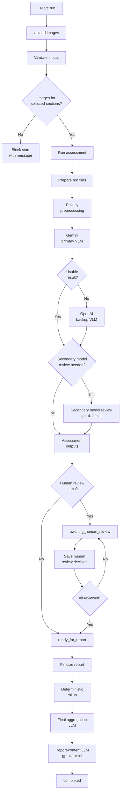
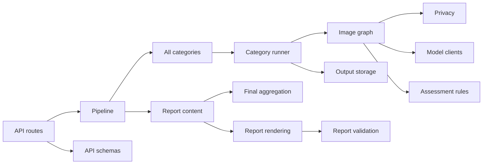

# SchoolReview AI Backend

This folder contains the Python backend for the SchoolReview AI prototype. It provides the inspection pipeline, model orchestration, report generation, and a small FastAPI app for local testing.

Model calls interpret visible evidence. Deterministic code validates schemas, counts issues, applies status floors, controls human-review gates, and renders artifacts.

It is not a safety certification system.

## What The Backend Does

- Validates inspection inputs and section names.
- Stages uploaded images into controlled run folders.
- Rejects unsupported, unreadable, empty, or oversized image files.
- Creates privacy-processed image copies before model calls.
- Runs a LangGraph image workflow.
- Uses Gemini as the primary vision model.
- Uses OpenAI as backup and as a secondary model review when needed.
- Saves full image-level audit JSON.
- Saves compact category-level summaries.
- Stops after assessment when human review is required.
- Generates final aggregation and report artifacts only after review is complete.
- Serves sanitized API responses without exposing local filesystem paths.

## Backend Flow



## API Statuses

```text
created
running
awaiting_human_review
ready_for_report
finalizing_report
completed
failed
```

`completed_with_human_review_required` is still part of the internal pipeline result schema for compatibility. The API maps assessment results into the review-gated statuses above.

## Run The API

From this `backend/` folder:

```bash
uv run uvicorn school_safety_validator.api.fastapi_application:app --reload --host 127.0.0.1 --port 8000
```

Health check:

```bash
curl http://127.0.0.1:8000/health
```

Swagger UI:

```text
http://127.0.0.1:8000/docs
```

Required for live model calls:

```text
GEMINI_API_KEY
OPENAI_API_KEY
```

Optional for tracing:

```text
LANGSMITH_API_KEY
LANGSMITH_PROJECT
LANGSMITH_TRACING
```

Tracing is disabled unless `LANGSMITH_TRACING=true` is set.

## Valid Inputs

Valid section names:

```text
ceiling
classroom
corridor
electrical
exterior
fire_extinguisher
staircase
washroom
other
```

Image uploads must be:

- `.jpg`, `.jpeg`, or `.png`
- readable as images
- no larger than 10 MB

Each selected section must have at least one uploaded image before assessment can start.

## Minimal API Flow

Create a run:

```bash
curl -s -X POST http://127.0.0.1:8000/inspection-runs \
  -H "Content-Type: application/json" \
  -d '{
    "school": {
      "name": "Example Government School",
      "inspection_date": "2026-06-30",
      "location": "Example District"
    },
    "sections": [
      {
        "section_name": "classroom",
        "section_comment": "Classroom inspection comments."
      }
    ]
  }'
```

Upload at least one image for each selected section:

```bash
curl -s -X POST "http://127.0.0.1:8000/inspection-runs/RUN_ID/sections/classroom/images" \
  -F "file=@/absolute/path/to/classroom.png;type=image/png" \
  -F "comment=Visible classroom condition image."
```

Start assessment:

```bash
curl -s -X POST "http://127.0.0.1:8000/inspection-runs/RUN_ID/start" \
  -H "Content-Type: application/json" \
  -d '{}'
```

`generate_report` is a deprecated compatibility field. Start runs assessment only, even when the field is set. Final reports are generated through `/finalize-report`.

Check status:

```bash
curl -s "http://127.0.0.1:8000/inspection-runs/RUN_ID"
```

The status response includes:

- `input_status`
- `progress`
- processed, failed, and not-inspected sections
- category summaries
- human-review items
- final report artifacts after report generation

Record a review decision when review items are returned:

```bash
curl -s -X POST "http://127.0.0.1:8000/inspection-runs/RUN_ID/human-review/REVIEW_ID" \
  -H "Content-Type: application/json" \
  -d '{"status": "reviewed", "notes": "Reviewed manually."}'
```

Generate the final report after all required items are reviewed:

```bash
curl -s -X POST "http://127.0.0.1:8000/inspection-runs/RUN_ID/finalize-report"
```

Download an artifact listed in the status response:

```bash
curl -L "http://127.0.0.1:8000/inspection-runs/RUN_ID/artifacts/final_report:markdown_report" \
  -o school_safety_final_report.md
```

Generated API-run files are written under the repository root:

```text
runs/api_runs/RUN_ID/
```

The API run store is in memory. If the server restarts, the active run records are cleared even though generated files remain on disk.
The API has no authentication and is intended only for a trusted local environment.

## Run From JSON

From this `backend/` folder:

```bash
uv run python scripts/run_pipeline_from_json.py \
  --input sample_data/sample_pipeline_request.json \
  --output school_validation_outputs/local_sample_result.json \
  --output-root school_validation_outputs/local_runs \
  --run-id local_sample
```

To run assessment without final report generation:

```bash
uv run python scripts/run_pipeline_from_json.py \
  --input sample_data/sample_pipeline_request.json \
  --output school_validation_outputs/local_sample_result.json \
  --output-root school_validation_outputs/local_runs \
  --run-id local_sample \
  --skip-report
```

Local JSON-run files are written under the output root you provide.

## Tests

```bash
uv run ruff check school_safety_validator tests
uv run pytest -q
```

The standard tests use fake or mocked model clients where needed and should not require live model API calls.

## Main Backend Modules



## Report Disclaimer

Generated reports preserve this disclaimer:

```text
This AI-assisted visual inspection summary does not certify safety, compliance, structural soundness, electrical safety, or serviceability. It must be reviewed by qualified personnel before decisions are made.
```
