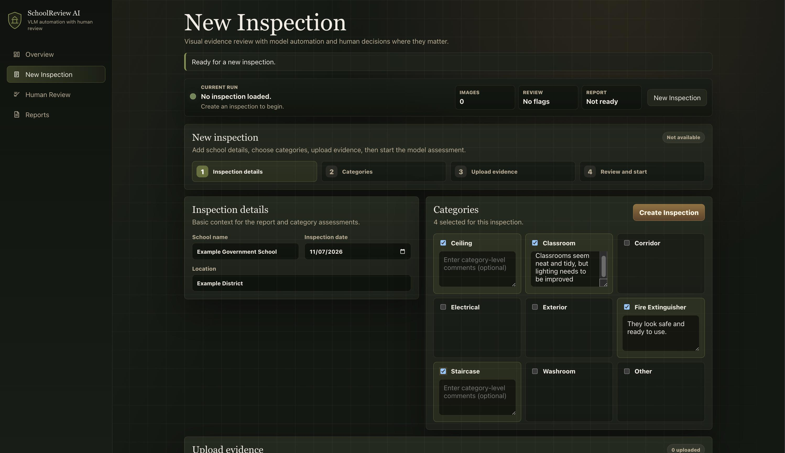
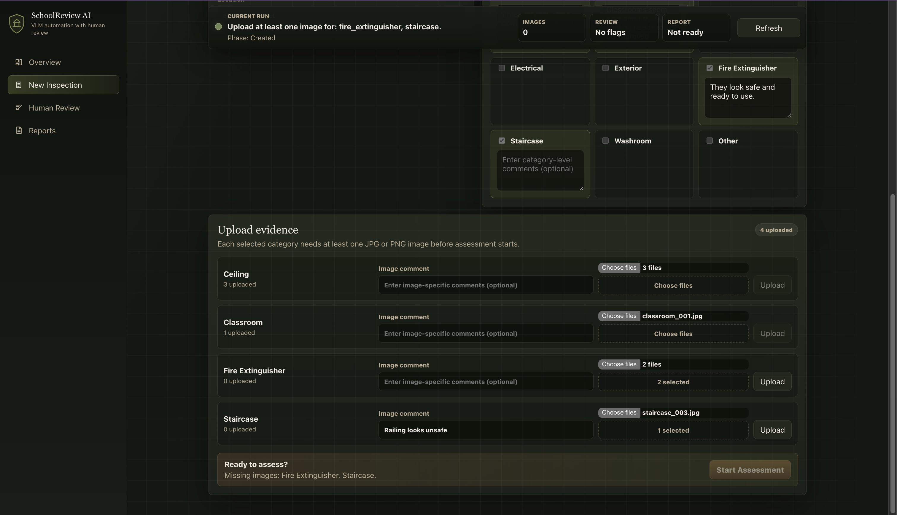
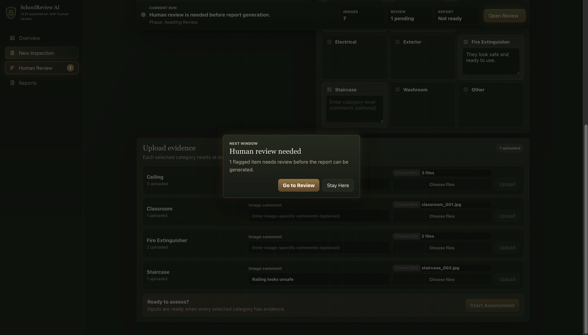
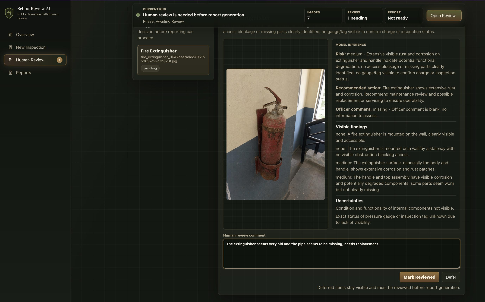
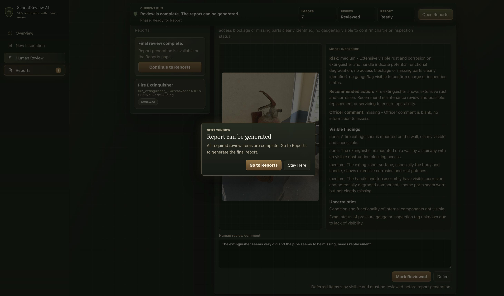
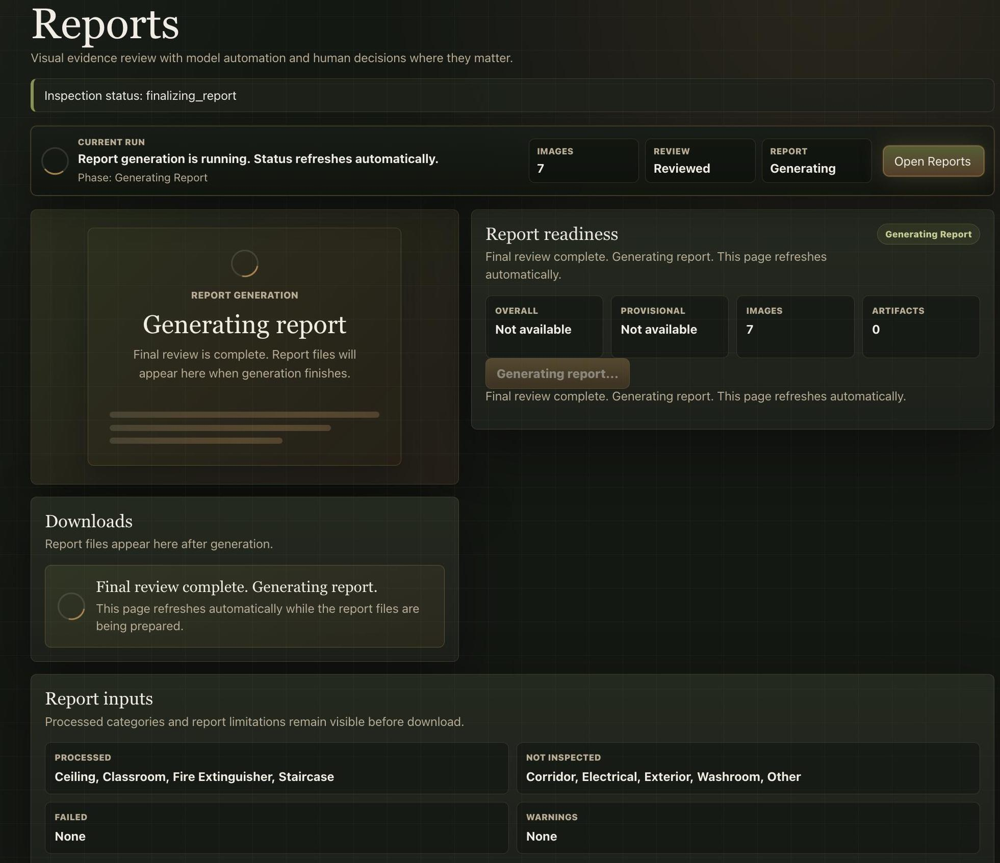
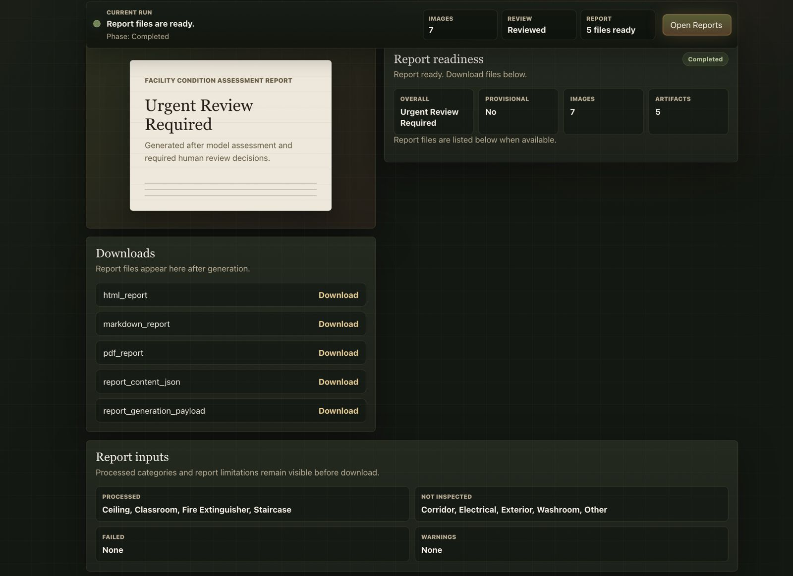
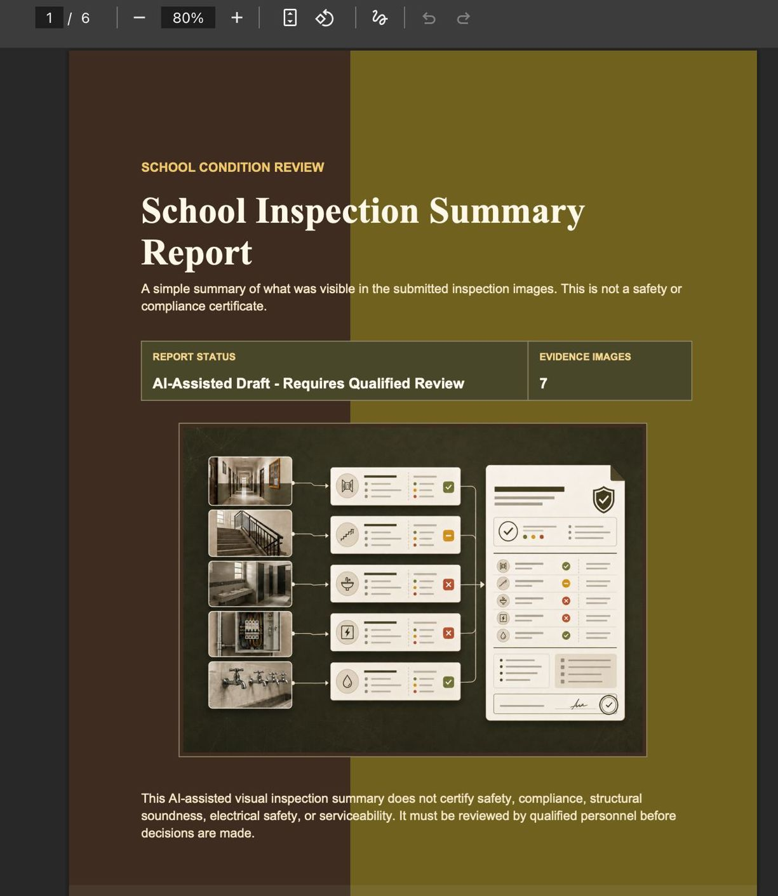
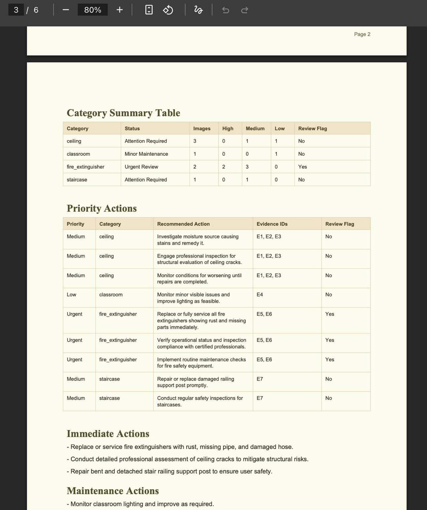

# SchoolReview AI: Software Tour

SchoolReview AI helps a user inspect a school using photos. The user adds photos and comments, reviews anything that needs a person to check it, and then creates a report.

This example uses four categories and seven photos. The report is a visual summary based on the uploaded photos. It does not certify safety or compliance, and qualified people should review it before making decisions.

## 1. Start a new inspection

Add the school details and choose the areas to inspect. Comments are optional. If a comment box is left empty, no comment is added.

## 2. Upload evidence and add image comments

Each chosen area needs at least one photo. You can add a comment to a photo, select more than one file, and see which areas still need photos before the inspection can start.

## 3. Send items for human review

Sometimes the software needs a person to check an item before a report can be created. The app makes this clear and takes the user to the review page.

## 4. Review the evidence in context

The review page shows the photo, what the software found, what it is unsure about, and a place for the reviewer to add their own comments and decision.

## 5. Create the report after review

Once the needed reviews are complete, the app lets the user move on to report creation.

## 6. Track report generation

The Reports page shows that the report is being prepared. It refreshes automatically and keeps the number of photos and review status visible.

## 7. Download the finished report

When the report is ready, the page shows the result and provides download links. This example includes HTML, Markdown, PDF, and JSON files.

## 8. Open the PDF summary

The PDF starts with a summary of the inspection and the number of photos used. It also states clearly that the report is not a safety or compliance certificate.

## 9. See the suggested actions

Later pages show the results for each category and list suggested next steps. This helps the user see what needs attention first.

## What the App Does

- Collects school details, photos, and optional comments.
- Checks that each chosen area has photos before starting.
- Uses the photos to help identify visible issues.
- Sends uncertain items to a person for review.
- Creates report files that can be downloaded.
- Keeps the report limited to what is visible in the submitted photos.
