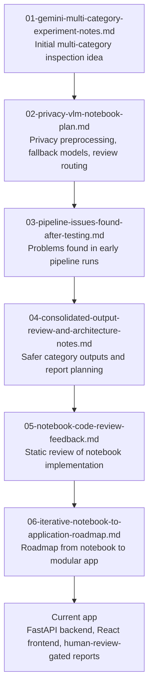

# Project Progress Notes

This folder contains selected historical notes from the development of SchoolReview AI.

These files are not setup instructions. They are included to show how the project evolved from notebook experiments into a modular backend, API, and simple frontend.

## How To Read These Notes

Read them as a development trail:

1. early inspection-validation ideas,
2. privacy-aware VLM planning,
3. issues found during notebook testing,
4. output and architecture review,
5. notebook code-review feedback,
6. the move from notebook workflow to backend modules.

Some file names, model names, paths, and line references reflect the project state at the time each note was written. The current behavior is documented in the root `README.md` and `backend/README.md`.

## Reading Order

## Notes

- The notes are useful for understanding design choices and tradeoffs.
- They may mention behavior that has since changed.
- They should not be used as the source of truth for commands, API routes, output paths, or setup.
- Use the current READMEs for how to run the project.
